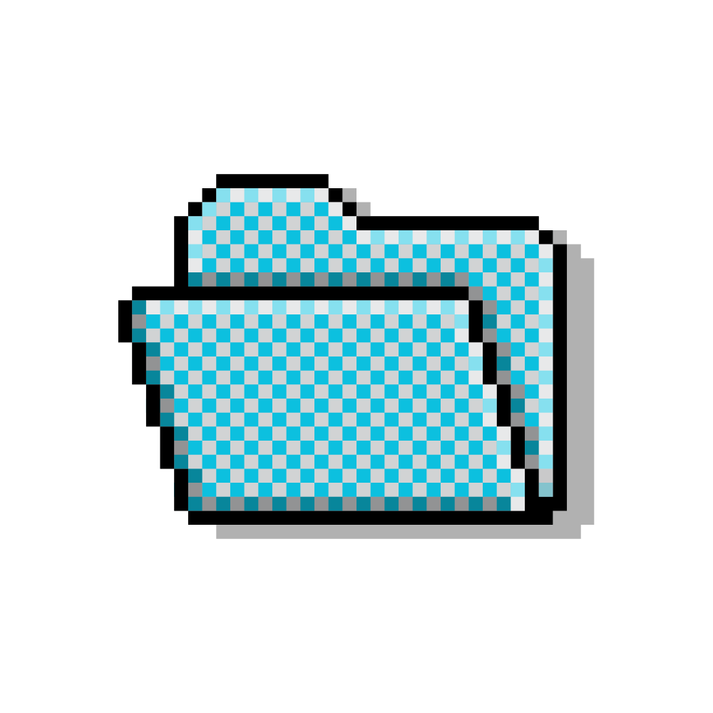

<div align="center">
  <a href="https://mychatarchive.com">
    
  </a>

  <h1>MyChatArchive</h1>

  <p><strong>Your AI conversation history, locally searchable by meaning.</strong></p>

  <p>
    <a href="https://www.gnu.org/licenses/agpl-3.0">
      
    </a>
    <a href="https://www.python.org/downloads/">
      
    </a>
    <a href="https://github.com/astral-sh/ruff">
      
    </a>
    <a href="https://github.com/1ch1n/mychatarchive/stargazers">
      
    </a>
  </p>

  <p>
    <a href="https://github.com/1ch1n/mychatarchive/issues">
      
    </a>
    <a href="https://github.com/1ch1n/mychatarchive">
      
    </a>
    <a href="https://mychatarchive.com">
      
    </a>
  </p>

  <h4>
    <a href="#quick-start">Quick Start</a> &nbsp;·&nbsp;
    <a href="#what-you-get">MCP Tools</a> &nbsp;·&nbsp;
    <a href="#the-pipeline">Pipeline</a> &nbsp;·&nbsp;
    <a href="#connecting-to-ai-tools">Connect</a> &nbsp;·&nbsp;
    <a href="ROADMAP.md">Roadmap</a> &nbsp;·&nbsp;
    <a href="https://mychatarchive.com">Website</a>
  </h4>
</div>

---

Import your chat exports from ChatGPT, Claude, Grok, Claude Code, and Cursor. Generate vector embeddings locally with sentence-transformers. Expose everything via an MCP server that any AI tool can query.

> **Open core:** The local pipeline (import, embed, summarize, search, MCP server) is free and AGPL-licensed. Cloud sync and hosted MCP are on the roadmap at [mychatarchive.com](https://mychatarchive.com).

---

## Why MyChatArchive

**Your archive, searchable.** Drop your ChatGPT, Claude, or Grok exports into the import folder, or let MyChatArchive auto-discover Claude Code and Cursor sessions from your machine. Full transcripts, local embeddings, MCP server. No cloud required.

| | |
|---|---|
| **Lossless** | Full message transcripts, not extracted summaries. You can always search the original. |
| **Local-first** | Single SQLite file. Embeddings run on your machine. Core needs no API keys. |
| **Developer-native** | Auto-discovers Claude Code sessions and Cursor conversations from your local machine on day one. |
| **MCP server** | Claude Desktop, Cursor, Claude Code, and any MCP client can search your archive. |

---

## Quick Start

```bash
git clone https://github.com/1ch1n/mychatarchive.git
cd mychatarchive
pip install .

# 1. Set up (creates drop folder, configures auto-discovery)
mychatarchive init

# 2. Import everything in one command
#    Auto-discovers Claude Code + Cursor, scans your drop folder
mychatarchive sync

# 3. (Optional) Generate thread summaries for richer context retrieval
#    Needs an API key: set OPENROUTER_API_KEY or ANTHROPIC_API_KEY
mychatarchive summarize

# 4. Generate local embeddings
mychatarchive embed

# 5. Start the MCP server
mychatarchive serve
```

Then connect from Claude Desktop or Cursor: run `mychatarchive mcp-config` and add the output to your client config. That's it.

---

## What You Get

Once the MCP server is running, any connected AI tool can call:

| Tool | What it does |
|------|-------------|
| `search_brain` | Semantic search by meaning across all conversations |
| `search_recent` | Recent conversations and captured thoughts by time range |
| `get_context` | Full context bundle for a topic: related threads, LLM summaries, thoughts |
| `capture_thought` | Save a thought or note with auto-embedding for future retrieval |
| `get_profile` | Snapshot of your recent focus areas, thread summaries, and thoughts |
| `get_current_datetime` | Current UTC datetime, injected into every tool response |

All search tools support filtering by platform, time range (`hours_back`, `since`), and thread group. Sort by relevance or recency.

**Example:** Ask Claude "What did I decide about the database architecture last month?" and it searches your actual conversation history semantically.

---

## Installation

### From source (recommended for now)

```bash
git clone https://github.com/1ch1n/mychatarchive.git
cd mychatarchive
pip install .
```

### Development install

```bash
pip install -e ".[dev]"
```

### Requirements

- Python 3.10+
- ~500MB disk for the embedding model (downloaded once, runs locally)
- No API keys needed for: sync, embed, search, serve
- `summarize` uses an LLM API for thread summaries (optional but recommended for `get_profile`)

---

## The Pipeline

**Full workflow:**

```bash
mychatarchive sync           # import from all sources
mychatarchive summarize      # LLM thread summaries (optional, needs API key)
mychatarchive embed          # generate vector embeddings locally
mychatarchive serve          # start MCP server
```

**Shortcut:**

```bash
mychatarchive sync --embed   # sync + embed in one shot
mychatarchive serve
```

The pipeline is incremental. Re-run `sync` any time -- SHA1 dedup means it's always safe. New messages get embedded on the next `embed` run without `--force`.

---

## Sync

```bash
mychatarchive sync           # import from all sources
mychatarchive sync --embed   # sync + generate embeddings in one shot
```

`sync` imports in three layers:

1. **Auto-discovery** -- Claude Code sessions (`~/.claude/projects/`) and Cursor conversations from local databases. Enabled by default, toggleable in `init`.
2. **Drop folder** -- anything in `~/.mychatarchive/imports/`. Drop your ChatGPT, Claude, or Grok export JSON here; format is auto-detected. Subdirectories scanned recursively.
3. **Named sources** -- custom paths or NAS shares you've configured with `mychatarchive sources add`.

All three deduplicate into the same archive via SHA1 hashing.

> **Note:** Auto-discovery covers Claude Code (the terminal agent) and Cursor. Claude web, mobile, and desktop app conversations require a manual export from Anthropic's settings -- drop the file in your imports folder and run `sync`.

---

## Summarize

Generate LLM thread summaries for richer context retrieval and the `get_profile` MCP tool.

```bash
mychatarchive summarize                              # default model via OpenRouter
mychatarchive summarize --model gpt-4o-mini          # specify model
mychatarchive summarize --key sk-...                 # pass API key inline
mychatarchive summarize --limit 50                   # process first 50 threads (for testing)
```

Summaries are stored in SQLite, embedded into their own vector index, and surfaced by `get_context` and `get_profile`. Without summaries, `get_profile` falls back to recent message chunks.

**API key:** Set `OPENROUTER_API_KEY` (default) or `ANTHROPIC_API_KEY`, or pass `--key` inline.

---

## Thread Groups

Organize threads into named groups for scoped search and context retrieval. Useful when your archive mixes personal conversations, coding work, and project threads -- you can scope search to exactly what's relevant.

```bash
# Create groups
mychatarchive groups create jarvis --description "Daily personal chats"
mychatarchive groups create coding --description "Dev work and technical threads"

# Browse threads to find IDs
mychatarchive groups show jarvis

# Add threads
mychatarchive groups add jarvis <thread_id> <thread_id>

# Scope search to a group
mychatarchive search "what did I decide" --group jarvis

# In MCP tools: search_brain(query="...", group="jarvis")
```

The `group` filter works on `search_brain`, `get_context`, `get_profile`, and the `search` CLI.

---

## Search from the CLI

```bash
mychatarchive search "database architecture decisions"
mychatarchive search "python error handling" --mode keyword
mychatarchive search "auth flow" --platform claude_code --group coding
mychatarchive search "what did I build" --hours 168 --sort time
mychatarchive search "api design" --since 2026-01-01
```

Default mode is semantic (vector search). Supports: `--mode keyword` for FTS, `--platform` for source filter, `--hours` / `--since` for time filter, `--sort time` for newest-first, `--group` for group filter.

---

## Export

```bash
mychatarchive export archive.json           # full structured export
mychatarchive export archive.csv            # spreadsheet-friendly
mychatarchive export archive.db             # full SQLite copy with embeddings
mychatarchive export chatgpt.json --platform chatgpt
mychatarchive export everything.json --include-thoughts
```

---

## Connecting to AI Tools

### Claude Desktop

```bash
mychatarchive mcp-config --client claude-desktop
```

Add the output to your config file:

- **macOS:** `~/Library/Application Support/Claude/claude_desktop_config.json`
- **Windows:** `%APPDATA%\Claude\claude_desktop_config.json`

### Cursor

```bash
mychatarchive mcp-config --client cursor
```

Add the output to your Cursor MCP settings.

### Remote access via SSE

For mobile or multi-device access, run the server on a NAS or always-on machine:

```bash
mychatarchive serve --transport sse --port 8420
```

Connect via Tailscale or WireGuard from any device. Works with Claude mobile and any MCP client that supports remote servers.

---

## Check Archive Stats

```bash
mychatarchive info
```

```
MyChatArchive - ~/.mychatarchive/archive.db
----------------------------------------
  Messages:    47,832
  Threads:     1,204
  Summaries:   1,204
  Embedded:    51,388 chunks
  Thoughts:    12
  Groups:      3
  Platforms:
    chatgpt: 38,541
    anthropic: 8,291
    grok: 1,000
```

---

## How It Works

```
Auto-discovery (Claude Code, Cursor)  --+
Drop folder (ChatGPT, Claude, Grok)   --+--> Parse + SHA1 dedup --> SQLite (FTS5)
Named sources (NAS, custom paths)     --+              |
                                                       v
                                           sentence-transformers (local)
                                                       |
                                                       v
                                           sqlite-vec (cosine KNN)
                                                       |
                                                       v
                                           MCP server (stdio / SSE)
                                                       |
                                          Claude Desktop / Cursor /
                                          Claude Code / Claude Mobile
```

### Stack

| Component | Technology |
|-----------|-----------|
| **Storage** | SQLite + FTS5 (full-text) + sqlite-vec (vectors) |
| **Embeddings** | sentence-transformers `all-MiniLM-L6-v2` (384 dim, local) |
| **Summarization** | Any OpenAI-compatible API (OpenRouter default, Anthropic fallback) |
| **Interface** | MCP server (stdio + SSE transport) |
| **Deduplication** | SHA1-based stable message IDs |
| **CLI** | Python argparse + rich |

### Data stays local

- Embeddings run locally. No OpenAI, no cloud.
- Database is a single SQLite file at `~/.mychatarchive/archive.db`.
- MCP server runs over stdio by default (local pipe, no network).
- `summarize` is the only step that makes outbound API calls. It's optional.

---

## CLI Reference

| Command | Description |
|---------|-------------|
| `mychatarchive init` | Interactive setup (drop folder, auto-discovery, backends) |
| `mychatarchive sync` | Import from all sources (auto + drop folder + named) |
| `mychatarchive sync --embed` | Sync + generate embeddings in one shot |
| `mychatarchive import <file\|dir>` | Import a single file or directory |
| `mychatarchive import --from <name>` | Import from a named source |
| `mychatarchive sources add <name> <path>` | Add a named import source |
| `mychatarchive sources list` | Show all sources (auto + drop + named) |
| `mychatarchive sources remove <name>` | Remove a source |
| `mychatarchive sources rename <old> <new>` | Rename a source |
| `mychatarchive summarize` | Generate LLM thread summaries (needs API key) |
| `mychatarchive groups list` | List all thread groups |
| `mychatarchive groups create <name>` | Create a thread group |
| `mychatarchive groups add <group> <ids...>` | Add threads to a group |
| `mychatarchive groups show <name>` | Show threads in a group |
| `mychatarchive groups delete <name>` | Delete a group (threads are not deleted) |
| `mychatarchive embed` | Generate vector embeddings |
| `mychatarchive export <output>` | Export to JSON, CSV, or SQLite copy |
| `mychatarchive serve` | Start MCP server |
| `mychatarchive search <query>` | Search from the terminal |
| `mychatarchive info` | Show archive statistics |
| `mychatarchive mcp-config` | Print MCP client configuration |

All commands accept `--db /path/to/archive.db` to override the default database location.

---

## Project Structure

```
mychatarchive/
+-- src/mychatarchive/
|   +-- cli.py              # Unified CLI
|   +-- config.py           # Paths, constants, config management
|   +-- db.py               # Data access layer (delegates to backends)
|   +-- embeddings.py       # Local embedding pipeline
|   +-- chunker.py          # Message chunking for embeddings
|   +-- ingest.py           # Import engine with SHA1 dedup
|   +-- summarizer.py       # LLM thread summarization pipeline
|   +-- parsers/
|   |   +-- chatgpt.py      # ChatGPT conversations.json
|   |   +-- anthropic.py    # Claude export format
|   |   +-- grok.py         # Grok/X.AI export format
|   |   +-- claude_code.py  # Claude Code JSONL sessions
|   |   +-- cursor.py       # Cursor IDE SQLite databases
|   +-- backends/           # Pluggable storage, embeddings, transport
|   +-- mcp/
|       +-- server.py       # MCP server (6 tools)
+-- tests/
+-- pyproject.toml
+-- ROADMAP.md
```

---

## Adding a New Parser

Create `src/mychatarchive/parsers/yourplatform.py`:

```python
from typing import Iterator

def parse(input_path: str) -> Iterator[dict]:
    """Yield normalized messages."""
    yield {
        "thread_id": "unique-thread-id",
        "thread_title": "Conversation Title",
        "role": "user",
        "content": "Message text",
        "created_at": 1700000000.0,
    }
```

Register it in `src/mychatarchive/parsers/__init__.py`.

---

## Default Data Location

```
~/.mychatarchive/
+-- archive.db          # SQLite database (messages + vectors + thoughts)
+-- config.json         # Backend + source configuration
+-- imports/            # Drop folder for export files
```

Override with `--db /path/to/your.db` on any command, or set a custom drop folder path in `init`.

---

## Roadmap

- [x] Multi-platform import (ChatGPT, Claude, Grok, Claude Code, Cursor)
- [x] Local vector embeddings (sentence-transformers, no API)
- [x] MCP server: search_brain, search_recent, get_context, capture_thought, get_profile, get_current_datetime
- [x] Thread summaries via any OpenAI-compatible API (`mychatarchive summarize`)
- [x] Thread groups with group-scoped search (`mychatarchive groups`)
- [x] Platform, time, and group filters on search and all MCP tools
- [x] Pluggable backend architecture (storage, embeddings, transport)
- [x] Export (JSON, CSV, SQLite copy)
- [x] SSE transport for remote MCP access
- [x] One-command sync with auto-discovery + drop folder + named sources
- [ ] Additional parsers (Gemini, Perplexity, Copilot)
- [ ] Grouping UI (browse threads and assign to groups without knowing thread IDs)
- [ ] Analysis engine (deep prompts against your full archive)
- [ ] Auto-sync (no manual exports needed)
- [ ] PyPI publish
- [ ] Web dashboard + hosted option at [mychatarchive.com](https://mychatarchive.com)
- [ ] Docker image for one-command self-hosting

See [ROADMAP.md](ROADMAP.md) for the full phased plan.

---

## Open Core

| | Tier |
|-|------|
| Import, embed, summarize, groups, MCP server (stdio) | Free / local (AGPL-3.0) |
| SSE transport with auth, cloud sync, hosted MCP, teams | Planned at [mychatarchive.com](https://mychatarchive.com) |

The principle: anything that runs on your machine is free. Anything that requires infrastructure is paid.

**Licensing:** Local and self-hosted use is free under AGPL-3.0. Commercial use or offering MyChatArchive as a hosted service requires a commercial license. Contact [channing@mychatarchive.com](mailto:channing@mychatarchive.com) for commercial licensing.

---

## License

AGPL-3.0 -- see [LICENSE](LICENSE).

---

<div align="center">
  <strong>Built by <a href="https://github.com/1ch1n">Channing Chasko</a></strong>
  <br>
  <a href="https://mychatarchive.com">mychatarchive.com</a>
  <br><br>
  <a href="https://github.com/1ch1n/mychatarchive/stargazers">
    
  </a>
</div>
